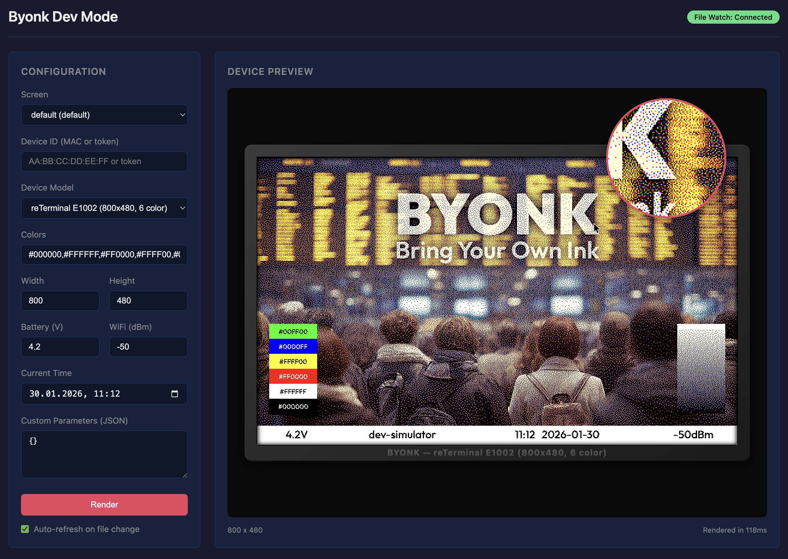

# Byonk

[](https://github.com/oetiker/byonk/actions/workflows/ci.yml)
[](https://github.com/oetiker/byonk/releases/latest)
[](LICENSE)

**Bring Your Own Ink** - A self-hosted content server for [TRMNL](https://usetrmnl.com) e-ink devices.

Byonk lets you create custom screens for your TRMNL device using Lua scripts and SVG templates. Fetch data from any source, render it beautifully, and display it on your e-ink screen.

## Quick Start

```bash
docker run --rm -it --pull always -p 3000:3000 ghcr.io/oetiker/byonk:latest
```

Point your TRMNL device to `http://your-server:3000` and it will start displaying content.

## Dev Mode

Byonk includes a development mode with a web-based device simulator for creating and testing screens:

```bash
docker run --rm -it --pull always -p 3000:3000 ghcr.io/oetiker/byonk:latest dev
```

Then open `http://localhost:3000/dev` in your browser:



## Documentation

Full documentation is available at **[oetiker.github.io/byonk](https://oetiker.github.io/byonk)**:

- [Installation Guide](https://oetiker.github.io/byonk/guide/installation.html)
- [Creating Your First Screen](https://oetiker.github.io/byonk/tutorial/first-screen.html)
- [Lua API Reference](https://oetiker.github.io/byonk/api/lua-api.html)
- [Dev Mode](https://oetiker.github.io/byonk/guide/dev-mode.html)

## License

MIT License - see [LICENSE](LICENSE)
