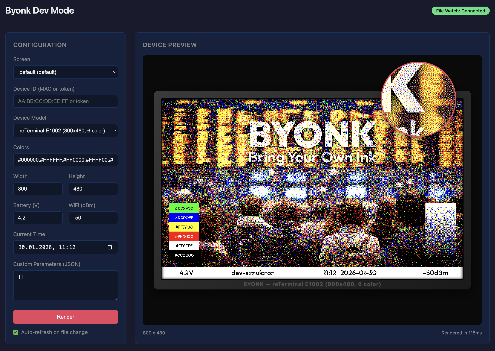

# Byonk

[](https://github.com/oetiker/byonk/actions/workflows/ci.yml)
[](https://github.com/oetiker/byonk/releases/latest)
[](LICENSE)

**Bring Your Own Ink** - A self-hosted content server for [TRMNL](https://usetrmnl.com) e-ink devices.

Byonk lets you create custom screens for your TRMNL device using Lua scripts and SVG templates. Fetch data from any source, render it beautifully, and display it on your e-ink screen.

## Quick Start

```bash
docker run --rm -it --pull always -p 3000:3000 ghcr.io/oetiker/byonk:latest
```

Point your TRMNL device to `http://your-server:3000` and it will start displaying content.

## Home Assistant

Byonk runs on Home Assistant in two parts — install both:

- **The Byonk app** (formerly "add-on") — the server itself, running under
  Supervisor and serving your TRMNL devices on host port 3000.
- **The Byonk integration** (via HACS) — onboards TRMNL devices as Home Assistant
  devices with entities for screen selection, battery, signal and screen
  parameters, and provisions the admin token automatically.

Install the integration first and it installs and starts the app for you,
zero-touch:

1. **HACS → Integrations → ⋮ → Custom repositories**, add
   `https://github.com/oetiker/byonk` as an **Integration**, install it and
   restart Home Assistant.
2. **Settings → Devices & Services → Add Integration** → *Byonk*.

See the [Home Assistant App](https://oetiker.github.io/byonk/dev/guide/ha-addon.html)
and [Home Assistant Integration](https://oetiker.github.io/byonk/dev/guide/ha-integration.html)
guides for details.

## Dev Mode

Byonk includes a development mode with a web-based device simulator for creating and testing screens:

```bash
docker run --rm -it --pull always -p 3000:3000 ghcr.io/oetiker/byonk:latest dev
```

Then open `http://localhost:3000/dev` in your browser:



## Documentation

Full documentation is available at **[oetiker.github.io/byonk](https://oetiker.github.io/byonk)**:

- [Installation Guide](https://oetiker.github.io/byonk/dev/guide/installation.html)
- [Home Assistant App](https://oetiker.github.io/byonk/dev/guide/ha-addon.html)
- [Home Assistant Integration](https://oetiker.github.io/byonk/dev/guide/ha-integration.html)
- [Configuration](https://oetiker.github.io/byonk/dev/guide/configuration.html)
- [Creating Your First Screen](https://oetiker.github.io/byonk/dev/tutorial/first-screen.html)
- [Lua API Reference](https://oetiker.github.io/byonk/dev/api/lua-api.html)
- [HTTP API](https://oetiker.github.io/byonk/dev/api/http-api.html)
- [Admin API](https://oetiker.github.io/byonk/dev/api/admin-api.html)
- [Dev Mode](https://oetiker.github.io/byonk/dev/guide/dev-mode.html)

## License

MIT License - see [LICENSE](LICENSE)
