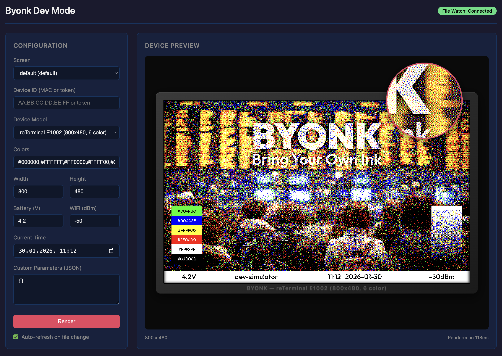

# Byonk

[](https://github.com/oetiker/byonk/actions/workflows/ci.yml)
[](https://github.com/oetiker/byonk/releases/latest)
[](LICENSE)

**Bring Your Own Ink** - A self-hosted content server for [TRMNL](https://usetrmnl.com) e-ink devices.

Byonk lets you create custom screens for your TRMNL device using Lua scripts and SVG templates. Fetch data from any source, render it beautifully, and display it on your e-ink screen.

## Quick Start

```bash
docker run --rm -it --pull always -p 3000:3000 ghcr.io/oetiker/byonk:latest
```

Point your TRMNL device to `http://your-server:3000` and it will start displaying content.

## Home Assistant

Byonk installs itself as a Home Assistant app, and brings its own integration
with it — device onboarding, entities, and automatic token provisioning:

1. In Home Assistant, go to **Settings → Apps → App store**.
2. Open the **⋮** menu, choose **Repositories**, add
   `https://github.com/oetiker/byonk` and select **Add**.
3. Find **Byonk** in the store, select **Install**, then **Start**.
4. Byonk asks you to restart Home Assistant. Do that
   (**Settings → System → Restart**).
5. After the restart, a **Byonk** card is waiting in
   **Settings → Devices & Services**. Select **Configure**.

See the [Home Assistant guide](https://oetiker.github.io/byonk/dev/guide/home-assistant.html)
for details.

## Dev Mode

Byonk includes a development mode with a web-based device simulator for creating and testing screens:

```bash
docker run --rm -it --pull always -p 3000:3000 ghcr.io/oetiker/byonk:latest dev
```

Then open `http://localhost:3000/dev` in your browser:



## Documentation

Full documentation is available at **[oetiker.github.io/byonk](https://oetiker.github.io/byonk)**:

- [Installation Guide](https://oetiker.github.io/byonk/dev/guide/installation.html)
- [Home Assistant](https://oetiker.github.io/byonk/dev/guide/home-assistant.html)
- [Configuration](https://oetiker.github.io/byonk/dev/guide/configuration.html)
- [Creating Your First Screen](https://oetiker.github.io/byonk/dev/tutorial/first-screen.html)
- [Lua API Reference](https://oetiker.github.io/byonk/dev/api/lua-api.html)
- [HTTP API](https://oetiker.github.io/byonk/dev/api/http-api.html)
- [Admin API](https://oetiker.github.io/byonk/dev/api/admin-api.html)
- [Dev Mode](https://oetiker.github.io/byonk/dev/guide/dev-mode.html)

## License

MIT License - see [LICENSE](LICENSE)
