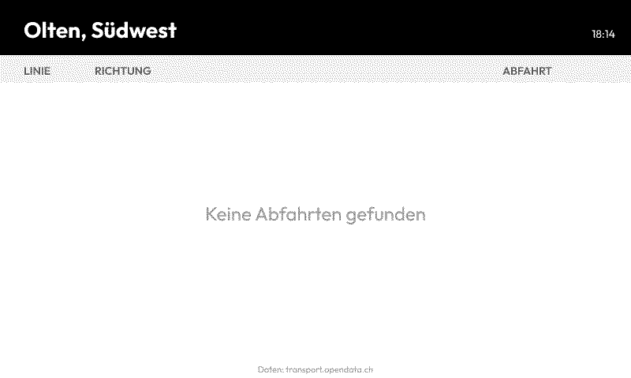

# Byonk

**Bring Your Own Ink** - Self-hosted content server for TRMNL e-ink devices

## Features

- **Lua Scripting** - Fetch data from any API, scrape websites, process JSON - all with simple Lua scripts.
- **SVG Templates** - Design pixel-perfect screens using SVG with Tera templating (Jinja2-style syntax).
- **Variable Fonts** - Full support for variable font weights via CSS font-variation-settings.
- **Smart Refresh** - Scripts control when devices refresh - optimize for fresh data and battery life.
- **4-Level Grayscale** - Floyd-Steinberg dithering optimized for e-paper's 4 gray levels.
- **Device Mapping** - Assign different screens to different devices via simple YAML configuration.

## Quick Start

```bash
# Clone and build
git clone https://github.com/oetiker/byonk.git
cd byonk
cargo build --release

# Run the server
./target/release/byonk
```

Point your TRMNL device to `http://your-server:3000` and it will start displaying content.

## How It Works


1. **Lua scripts** fetch data from APIs or scrape websites
2. **SVG templates** render the data into beautiful layouts
3. **Renderer** converts SVG to dithered PNG optimized for e-ink
4. **Device** displays the content and sleeps until next refresh

## Example: Transit Departures

**Lua Script** fetches real-time data:
```lua
local response = http_get("https://transport.opendata.ch/v1/stationboard?station=Olten")
local data = json_decode(response)

return {
  data = { departures = data.stationboard },
  refresh_rate = 60
}
```

**SVG Template** renders the display:
```svg
<svg viewBox="0 0 800 480">
  
  <text y="{{ 100 + loop.index0 * 40 }}">
    {{ dep.category }}{{ dep.number }} → {{ dep.to }}
  </text>
  
</svg>
```

**Result on e-ink display:**



## Next Steps

- [Installation Guide](guide/installation.md) - Set up Byonk on your server
- [Architecture](concepts/architecture.md) - Understand how Byonk works
- [Create Your First Screen](tutorial/first-screen.md) - Build a custom display
- [API Reference](api/http-api.md) - HTTP and Lua API documentation
