# Architecture Overview

Byonk is designed as a content server that bridges dynamic data sources with e-ink displays. This page explains how the system is structured and how requests flow through it.

## System Overview

## Core Components

### HTTP Router

The entry point for all device requests. Built with [Axum](https://github.com/tokio-rs/axum), it handles:

- **Device registration** (`/api/setup`)
- **Content requests** (`/api/display`, `/api/image/:id`)
- **Logging** (`/api/log`)
- **API documentation** (`/swagger-ui`)

### Device Registry

Stores device information in memory:

- MAC address to API key mapping
- Device metadata (firmware version, model, battery level)
- Last seen timestamps

> **Note:** The current implementation uses an in-memory store. Device registrations are lost on restart. The architecture supports adding database persistence in the future.

### URL Signer

Provides security for image URLs using HMAC-SHA256:

- Signs image URLs with expiration timestamps
- Validates signatures on image requests
- Prevents unauthorized access to device content

### Content Pipeline

The heart of Byonk - orchestrates content generation:

1. Looks up screen configuration for the device
2. Executes Lua script with device parameters
3. Renders SVG template with script data
4. Converts SVG to PNG with dithering

### Lua Runtime

Executes Lua scripts in a sandboxed environment:

- HTTP client for fetching external data
- JSON/HTML parsing utilities
- Time functions
- Logging

### Template Service

Renders SVG templates using [Tera](https://tera.netlify.app/):

- Jinja2-style syntax
- Custom filters (`truncate`, `format_time`)
- Fresh loading on each request (hot reload)

### SVG Renderer

Converts SVG to PNG optimized for e-ink:

- Uses [resvg](https://github.com/RazrFalcon/resvg) for rendering
- Loads custom fonts from `fonts/` directory
- Floyd-Steinberg dithering to 4 gray levels
- Outputs 2-bit indexed PNG

## Request Flow

```mermaid
sequenceDiagram
    participant Device as 📱 TRMNL Device
    participant Router as 🌐 HTTP Router
    participant Registry as 📋 Device Registry
    participant Pipeline as ⚙️ Content Pipeline
    participant Lua as 📜 Lua Runtime
    participant Template as 🎨 Template Service
    participant Renderer as 🖼️ SVG Renderer

    Note over Device,Router: 1. Device Setup (first connection)
    Device->>Router: GET /api/setup<br/>Headers: ID, FW-Version, Model
    Router->>Registry: Register device
    Registry-->>Router: API key generated
    Router-->>Device: { api_key, friendly_id }

    Note over Device,Router: 2. Display Request (needs content)
    Device->>Router: GET /api/display<br/>Headers: Access-Token, ID
    Router->>Pipeline: Generate content
    Pipeline->>Lua: Execute script
    Lua-->>Pipeline: { data, refresh_rate }
    Pipeline->>Template: Render SVG
    Template-->>Pipeline: SVG document
    Pipeline->>Renderer: Convert to PNG
    Renderer-->>Pipeline: Dithered PNG
    Pipeline-->>Router: Cache content
    Router-->>Device: { image_url (signed), refresh_rate }

    Note over Device,Router: 3. Image Fetch
    Device->>Router: GET /api/image/:id?sig=...
    Router-->>Device: PNG image bytes
```

### Request Details

**1. Device Setup** — When a TRMNL device first connects, it registers and receives an API key for subsequent requests.

**2. Display Request** — The device requests content. Byonk runs the Lua script, renders the template, generates a dithered PNG, and returns a signed URL.

**3. Image Fetch** — Device fetches the cached PNG using the signed URL.

The content pipeline performs these steps:

1. **Verify signature** - Check HMAC and expiration
2. **Lookup device** - Find screen config and params
3. **Execute Lua** - Run script, get data + refresh_rate
4. **Render template** - Apply data to SVG template
5. **Generate PNG** - Convert SVG, apply dithering
6. **Return image** - Send PNG to device

## Technology Stack

| Component | Technology |
|-----------|------------|
| Web framework | Axum |
| Async runtime | Tokio |
| Scripting | mlua (Lua 5.4) |
| Templating | Tera |
| SVG rendering | resvg (patched for variable fonts) |
| HTTP client | reqwest |
| HTML parsing | scraper |

## Design Principles

### Fresh Loading

Lua scripts and SVG templates are loaded from disk on every request. This enables:

- Live editing during development
- No restart needed for content changes
- Simple deployment (just copy files)

### Blocking Isolation

CPU-intensive operations run in a blocking task pool:

- Lua HTTP requests
- SVG rendering
- Image encoding

This prevents blocking the async event loop.

### Graceful Degradation

If content generation fails, devices receive an error screen rather than nothing. The error message helps debugging while keeping the device functional.

## Security Model

### Signed URLs

Image URLs are signed with HMAC-SHA256:

- 1-hour expiration
- Prevents URL enumeration
- Protects against unauthorized access

### No Authentication Required

The `/api/setup` endpoint is open - any device can register. This matches TRMNL's design where devices self-register.

### Script Sandboxing

Lua scripts run in a controlled environment:

- Only exposed functions are available
- No filesystem access
- No arbitrary code execution
