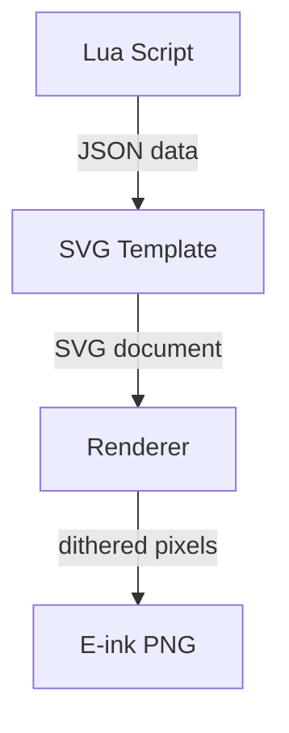

# Content Pipeline

The content pipeline is how Byonk transforms data into images for e-ink displays. This page explains each stage in detail.

## Pipeline Overview



| Stage | Input | Processing | Output |
|-------|-------|------------|--------|
| **Lua Script** | API endpoints, params | Fetch data, parse JSON/HTML | Structured data |
| **SVG Template** | Data + device context | Tera templating, layout | SVG document |
| **Renderer** | SVG document | Rasterize, grayscale, dither | Pixel buffer |
| **E-ink PNG** | Pixel buffer | Quantize to 4 levels, encode | 2-bit PNG |

## Stage 1: Lua Script Execution

Lua scripts fetch and process data from external sources.

### Input

The script receives a global `params` table from `config.yaml`:

```yaml
# config.yaml
devices:
  "94:A9:90:8C:6D:18":
    screen: transit
    params:
      station: "Olten, Bahnhof"
      limit: 8
```

```lua
-- In your script
local station = params.station  -- "Olten, Bahnhof"
local limit = params.limit      -- 8
```

### Processing

Scripts can:

- **Fetch HTTP data**: APIs, web pages, JSON endpoints
- **Parse content**: JSON decoding, HTML scraping
- **Transform data**: Filter, sort, calculate

```lua
local response = http_get("https://api.example.com/data")
local data = json_decode(response)

local filtered = {}
for _, item in ipairs(data.items) do
  if item.active then
    table.insert(filtered, item)
  end
end
```

### Output

Scripts must return a table with two fields:

```lua
return {
  data = {
    -- Any structure - passed to template
    title = "My Screen",
    items = filtered,
    updated_at = time_format(time_now(), "%H:%M")
  },
  refresh_rate = 300  -- Seconds until next update
}
```

### Refresh Rate

The `refresh_rate` controls when the device fetches new content:

- **Low values** (30-60s): Real-time data (transit, stocks)
- **Medium values** (300-900s): Regular updates (weather, calendar)
- **High values** (3600+s): Static content

> **Tip:** Calculate refresh rates dynamically. For transit, refresh after the next departure:
>
> ```lua
> local seconds_until_departure = departure_time - time_now()
> return {
>   data = departures,
>   refresh_rate = seconds_until_departure + 30
> }
> ```

## Stage 2: Template Rendering

SVG templates use [Tera](https://tera.netlify.app/) syntax (similar to Jinja2).

### Input

The template receives a structured context with three namespaces:

### Template Namespaces

| Namespace | Source | Description |
|-----------|--------|-------------|
| `data.*` | Lua script `data` return | Your script's output |
| `device.*` | Device headers | Battery voltage, RSSI |
| `params.*` | config.yaml | Device-specific params |

### Device Context Variables

These are automatically available under `device.*` (when reported by the device):

| Variable | Type | Description |
|----------|------|-------------|
| `device.battery_voltage` | float | Battery voltage (e.g., 4.12) |
| `device.rssi` | integer | WiFi signal strength in dBm (e.g., -65) |

```svg
<!-- Show battery voltage in header -->
<text x="780" y="30" text-anchor="end">
  {{ device.battery_voltage | round(precision=2) }}V
</text>
```

> **Note:** Device info is also available in Lua scripts via the `device` global table.

### Syntax

**Variables**:
```svg
<text>{{ data.title }}</text>
<text>{{ data.user.name }}</text>
<text>{{ device.battery_voltage }}V</text>
<text>{{ params.station }}</text>
```

**Loops**:
```svg

<text y="{{ 100 + loop.index0 * 30 }}">{{ item.name }}</text>

```

**Conditionals**:
```svg

<text fill="red">{{ data.error }}</text>

<text>All good!</text>

```

### Built-in Filters

| Filter | Usage | Description |
|--------|-------|-------------|
| `truncate` | `{{ data.text \| truncate(length=30) }}` | Truncate with ellipsis |
| `format_time` | `{{ data.ts \| format_time(format="%H:%M") }}` | Format Unix timestamp |
| `length` | `{{ data.items \| length }}` | Get array/object length |

### Output

A complete SVG document ready for rendering.

## Stage 3: SVG to PNG Conversion

The renderer converts SVG to a PNG optimized for e-ink displays.

### Font Handling

1. **Custom fonts** from `fonts/` directory (loaded first)
2. **System fonts** as fallback
3. **Variable fonts** supported via CSS `font-variation-settings`

```svg
<style>
  .title {
    font-family: Outfit;
    font-variation-settings: "wght" 700;
  }
</style>
```

### Scaling

SVGs are scaled to fit the display while maintaining aspect ratio:

- TRMNL OG: 800 × 480 pixels
- TRMNL X: 1872 × 1404 pixels

The image is centered if the aspect ratio doesn't match exactly.

### Grayscale Conversion

Colors are converted to grayscale using the ITU-R BT.709 formula:

```
Y = 0.2126 × R + 0.7152 × G + 0.0722 × B
```

This matches human perception of brightness.

## Stage 4: Floyd-Steinberg Dithering

E-ink displays only support 4 gray levels. Dithering creates the illusion of more shades.

### How It Works

```
For each pixel:
  1. Quantize to nearest level: [0, 85, 170, 255]
  2. Calculate error = old_value - new_value
  3. Distribute error to neighbors:
           X   7/16
       3/16 5/16 1/16
```

### Gray Levels

| Level | RGB Value | Appearance |
|-------|-----------|------------|
| 0 | (0, 0, 0) | Black |
| 1 | (85, 85, 85) | Dark gray |
| 2 | (170, 170, 170) | Light gray |
| 3 | (255, 255, 255) | White |

### Output Format

The final PNG is:

- **2-bit indexed color** (4 colors in palette)
- **4 pixels per byte** for compact size
- **Size validated** against device limits (90KB for OG, 750KB for X)

## Error Handling

If any stage fails, Byonk generates an error screen:

```svg
<svg>
  <rect fill="white" stroke="red" stroke-width="5"/>
  <text>Error: Failed to fetch data</text>
  <text>Will retry in 60 seconds</text>
</svg>
```

This ensures:

- Device always receives valid content
- Error is visible for debugging
- Automatic retry on next refresh

## Performance Considerations

### What's Fast

- Lua script execution (milliseconds)
- Template rendering (milliseconds)
- Simple SVG rendering (10-50ms)

### What's Slower

- HTTP requests (network dependent)
- Complex SVG with many elements (100-500ms)
- Large images or gradients

### Optimization Tips

1. **Minimize HTTP calls** - Cache data in script if possible
2. **Simplify SVG** - Fewer elements = faster rendering
3. **Avoid gradients** - They're converted to dithered patterns anyway
4. **Use appropriate refresh rates** - Don't refresh more often than needed
