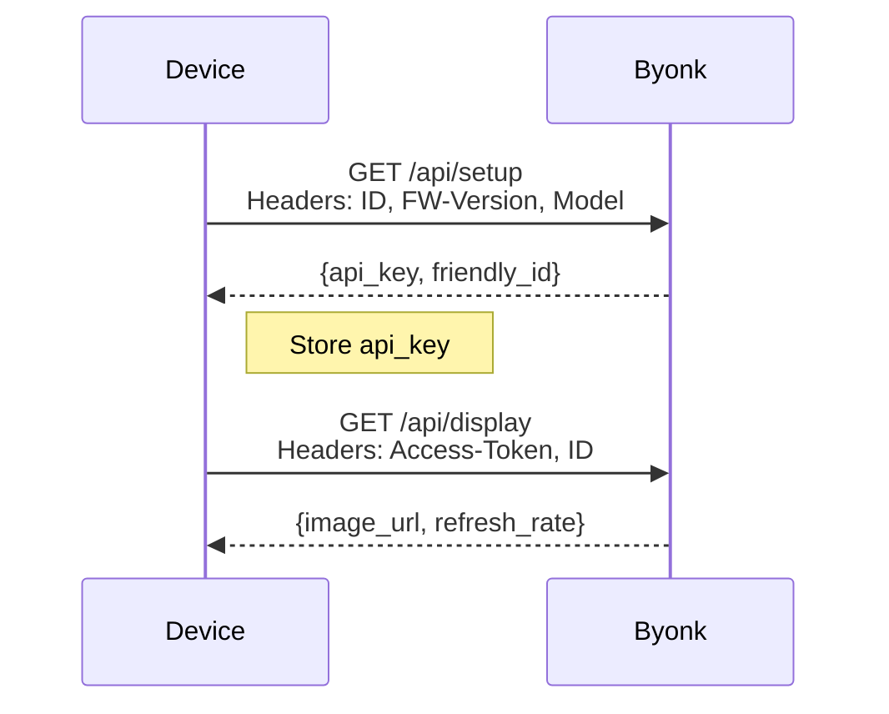
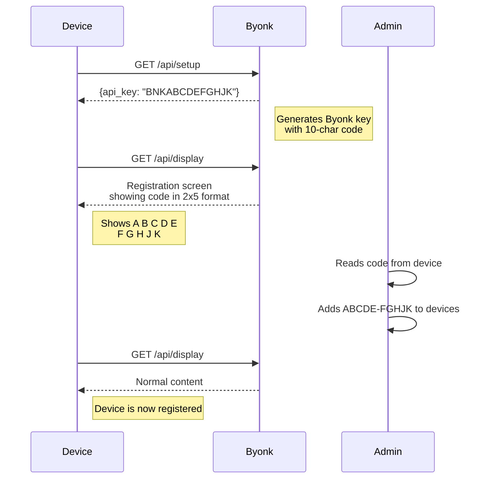

# Device Mapping

Byonk allows you to show different content on different TRMNL devices. This page explains how devices are identified, registered, and mapped to screens.

## How Devices Are Identified

Each TRMNL device has a unique **MAC address** that identifies it. This address is sent in the `ID` header with every request:

```
ID: 94:A9:90:8C:6D:18
```

Byonk uses this MAC address to:

1. Register new devices
2. Look up existing device configuration
3. Map devices to screens

## Device Registration Flow



### Setup Response

```json
{
  "status": 200,
  "api_key": "a1b2c3d4e5f6...",
  "friendly_id": "abc123def456"
}
```

- **api_key**: Authentication token for subsequent requests
- **friendly_id**: Human-readable identifier (12 hex characters)

## Configuration-Based Mapping

Devices are mapped to screens in `config.yaml`:

```yaml
devices:
  "94:A9:90:8C:6D:18":
    screen: transit
    params:
      station: "Olten, Bahnhof"

  "AA:BB:CC:DD:EE:FF":
    screen: weather
    params:
      city: "Zurich"

default_screen: default
```

### Lookup Order

When a device requests content:

1. **Exact MAC match** - Check if MAC is in `devices` section
2. **Default screen** - Use `default_screen` if no match
3. **Error** - Return error if no default configured

### MAC Address Format

MAC addresses in config must be:

- **Uppercase**: `"94:A9:90:8C:6D:18"` not `"94:a9:90:8c:6d:18"`
- **Colon-separated**: `"94:A9:90:8C:6D:18"` not `"94-A9-90-8C-6D-18"`
- **Quoted**: YAML requires quotes for strings with colons

## Device Parameters

Each device can have custom parameters passed to its screen's Lua script:

```yaml
devices:
  "94:A9:90:8C:6D:18":
    screen: transit
    params:
      station: "Olten, Südwest"
      limit: 8
      show_delays: true
```

In the Lua script:

```lua
local station = params.station      -- "Olten, Südwest"
local limit = params.limit          -- 8
local show_delays = params.show_delays  -- true
```

### Parameter Types

You can use any YAML type:

| Type | YAML | Lua |
|------|------|-----|
| String | `name: "Alice"` | `params.name` → `"Alice"` |
| Number | `count: 42` | `params.count` → `42` |
| Float | `temp: 21.5` | `params.temp` → `21.5` |
| Boolean | `enabled: true` | `params.enabled` → `true` |
| List | `items: [a, b]` | `params.items[1]` → `"a"` |
| Map | `user: {name: Bob}` | `params.user.name` → `"Bob"` |

### Same Screen, Different Parameters

Multiple devices can use the same screen with different parameters:

```yaml
devices:
  # Kitchen - shows nearby bus stop
  "94:A9:90:8C:6D:18":
    screen: transit
    params:
      station: "Olten, Südwest"

  # Office - shows train station
  "AA:BB:CC:DD:EE:FF":
    screen: transit
    params:
      station: "Olten, Bahnhof"
      limit: 10

  # Lobby - shows airport
  "BB:CC:DD:EE:FF:00":
    screen: transit
    params:
      station: "Zürich Flughafen"
      limit: 6
```

## Finding Your Device's MAC Address

The MAC address is shown:

1. **In Byonk logs** when the device connects:
   ```
   INFO Device registered device_id="94:A9:90:8C:6D:18"
   ```

2. **On the device** during setup (check TRMNL documentation)

3. **In your router's** connected devices list

## Default Screen

The `default_screen` provides a fallback for:

- Devices not yet configured
- New devices during testing
- Backup if config is incorrect

```yaml
default_screen: default
```

If no `default_screen` is set and a device isn't in the config, it receives an error response.

## Auto-Registration

Byonk automatically registers new devices on their first `/api/setup` call:

1. Generates a random API key (with Byonk prefix `BNK`)
2. Generates a friendly ID
3. Stores device in registry

No pre-configuration is needed - just add the device to `config.yaml` to assign a custom screen.

## Device Registration (Security Feature)

For enhanced security, Byonk supports **device registration** - requiring new devices to be explicitly approved before showing content.

### How It Works

1. When registration is enabled, unrecognized devices display a **10-character registration code** (in 2x5 format) instead of actual content
2. The admin adds this code to the `devices` section in `config.yaml`
3. On the next refresh, the device shows its configured content

### Enabling Registration

Add the `registration` section to your `config.yaml`:

```yaml
registration:
  enabled: true

devices:
  # Register devices by their 10-character code (shown on screen)
  # Use hyphenated format: XXXXX-XXXXX
  "ABCDE-FGHJK":
    screen: transit
    params:
      station: "Olten"

  # You can still use MAC addresses too
  "AA:BB:CC:DD:EE:FF":
    screen: weather
```

### Registration Flow



### API Key Format

Byonk API keys have a special format: `BNK` + 10-letter code.

Example: `BNKABCDEFGHJK` (13 chars total)

The 10-letter code:
- Uses only unambiguous uppercase letters (excludes I, L, O)
- Displays in 2x5 format for easy reading from e-ink
- Written as `ABCDE-FGHJK` in config (hyphenated for readability)
- Provides ~41 trillion combinations (23^10)

### Code vs MAC Address

You can use either the registration code or MAC address to identify devices:

```yaml
devices:
  # By registration code (read from device screen)
  "ABCDE-FGHJK":
    screen: transit

  # By MAC address (found in logs or router)
  "94:A9:90:8C:6D:18":
    screen: weather
```

The registration code is often more convenient since it's displayed on the device screen.

### Migrating from Other Servers

If a device was previously connected to a different server (e.g., TRMNL cloud), it may have a non-Byonk API key. When registration is enabled:

1. Byonk detects the foreign API key
2. Returns `reset_firmware: true` to force device re-setup
3. Device calls `/api/setup` and gets a new Byonk key
4. Device shows the registration screen with its code

### Registration Not Required?

If you don't need the security of device registration, simply omit the `registration` section or set `enabled: false`:

```yaml
# No registration section = all devices can connect
```

## Multiple Screens per Device?

Currently, each device shows one screen. However, you can create a "dashboard" screen that combines multiple data sources:

```lua
-- dashboard.lua
local weather = fetch_weather()
local transit = fetch_transit()
local calendar = fetch_calendar()

return {
  data = {
    weather = weather,
    transit = transit,
    calendar = calendar
  },
  refresh_rate = 300
}
```

## Device Metadata

Byonk tracks additional device information from request headers:

| Header | Description |
|--------|-------------|
| `FW-Version` | Firmware version |
| `Model` | Device model (og, x) |
| `Battery-Voltage` | Battery level |
| `RSSI` | WiFi signal strength |
| `Width`, `Height` | Display dimensions |

This metadata is stored in the device registry and can be used for:

- Debugging connectivity issues
- Monitoring battery levels
- Adapting content to device model

## Persistence

> **Warning:** The current implementation stores device registrations in memory. Registrations are lost on server restart.
>
> Devices will automatically re-register on their next request, but any collected metadata is lost.

Future versions may add database persistence for device data.
