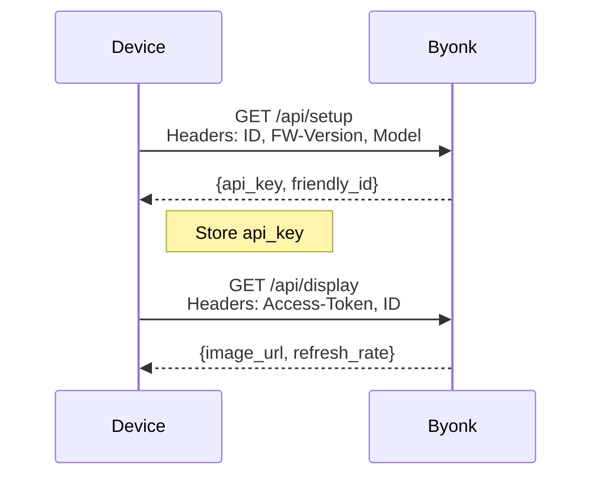

# Device Mapping

Byonk allows you to show different content on different TRMNL devices. This page explains how devices are identified, registered, and mapped to screens.

## How Devices Are Identified

Each TRMNL device has a unique **MAC address** that identifies it. This address is sent in the `ID` header with every request:

```
ID: 94:A9:90:8C:6D:18
```

Byonk uses this MAC address to:

1. Register new devices
2. Look up existing device configuration
3. Map devices to screens

## Device Registration Flow


```mermaid
sequenceDiagram
    participant Device
    participant Byonk

    Device->>Byonk: GET /api/setup<br/>Headers: ID, FW-Version, Model
    Byonk-->>Device: {api_key, friendly_id}
    Note right of Device: Store api_key

    Device->>Byonk: GET /api/display<br/>Headers: Access-Token, ID
    Byonk-->>Device: {image_url, refresh_rate}
```

### Setup Response

```json
{
  "status": 200,
  "api_key": "a1b2c3d4e5f6...",
  "friendly_id": "abc123def456"
}
```

- **api_key**: Authentication token for subsequent requests
- **friendly_id**: Human-readable identifier (12 hex characters)

## Configuration-Based Mapping

Devices are mapped to screens in `config.yaml`:

```yaml
devices:
  "94:A9:90:8C:6D:18":
    screen: byonk-builtin/useful/swiss-departure-board
    params:
      station: "Olten, Bahnhof"

  "AA:BB:CC:DD:EE:FF":
    screen: weather/forecast
    params:
      city: "Zurich"

  # Reserved key: shown to every un-onboarded or unassigned device
  DEFAULT:
    screen: byonk-builtin/default
```

A screen is referenced by a qualified `handle/path` reference: `handle` names a
registered package and `path` locates the screen folder within it. The bundled
screens live in the embedded `byonk-builtin` package (for example
`byonk-builtin/useful/swiss-departure-board`); third-party packages are
referenced through their own handle (for example `weather/forecast`).

### Lookup Order

When a device requests content:

1. **Exact MAC match** - Check if MAC is in `devices` section
2. **Reserved DEFAULT device** - Use the screen assigned to `devices.DEFAULT` if no match
3. **Built-in fallback** - If `devices.DEFAULT` isn't set, use the embedded `byonk-builtin/default` screen (this always resolves)

### MAC Address Format

MAC addresses in config must be:

- **Uppercase**: `"94:A9:90:8C:6D:18"` not `"94:a9:90:8c:6d:18"`
- **Colon-separated**: `"94:A9:90:8C:6D:18"` not `"94-A9-90-8C-6D-18"`
- **Quoted**: YAML requires quotes for strings with colons

## Device Parameters

See [Configuration — Parameters](../guide/configuration.md#parameters) for details on parameter types and usage.

## Finding Your Device's MAC Address

The MAC address is shown:

1. **In Byonk logs** when the device connects:
   ```
   INFO Device registered device_id="94:A9:90:8C:6D:18"
   ```

2. **On the device** during setup (check TRMNL documentation)

3. **In your router's** connected devices list

## The Reserved DEFAULT Device

`devices` reserves one key, `DEFAULT`, whose screen provides a fallback for:

- Devices not yet onboarded (shows the registration code)
- Devices registered but with no screen assigned
- New devices during testing

```yaml
devices:
  DEFAULT:
    screen: byonk-builtin/default
```

If `devices.DEFAULT` isn't set, byonk falls back to its embedded
`byonk-builtin/default` screen, so there's always something to show.

## Auto-Registration

Byonk automatically registers new devices on their first `/api/setup` call:

1. Generates a random API key (32-character hex string)
2. Derives a registration code from the key
3. Stores device in registry

No pre-configuration is needed - just add the device to `config.yaml` to assign a custom screen.

## Device Registration (Security Feature)

For enhanced security, Byonk supports **device registration** — requiring new devices to be explicitly approved before showing content.

See [Configuration — Device Registration](../guide/configuration.md#device-registration) for full setup instructions, registration code format, custom registration screens, and migration notes.

## Multiple Screens per Device?

Currently, each device shows one screen. However, you can create a "dashboard" screen that combines multiple data sources:

```lua
-- dashboard.lua
local weather = fetch_weather()
local transit = fetch_transit()
local calendar = fetch_calendar()

return {
  data = {
    weather = weather,
    transit = transit,
    calendar = calendar
  },
  refresh_rate = 300
}
```

## Device Metadata

Byonk tracks additional device information from request headers:

| Header | Description |
|--------|-------------|
| `FW-Version` | Firmware version |
| `Model` | Device model (og, x) |
| `Battery-Voltage` | Battery level |
| `RSSI` | WiFi signal strength |
| `Width`, `Height` | Display dimensions |

This metadata is stored in the device registry and can be used for:

- Debugging connectivity issues
- Monitoring battery levels
- Adapting content to device model

## Persistence

> **Warning:** The current implementation stores device registrations in memory. Registrations are lost on server restart.
>
> Devices will automatically re-register on their next request, but any collected metadata is lost.

Future versions may add database persistence for device data.
