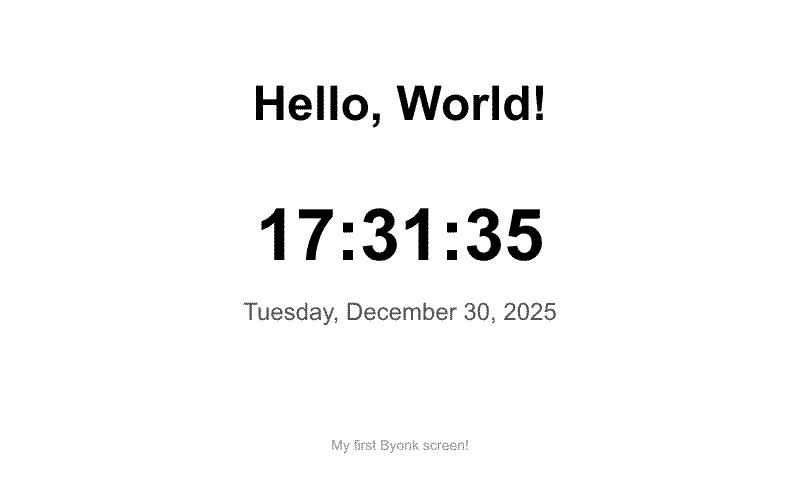
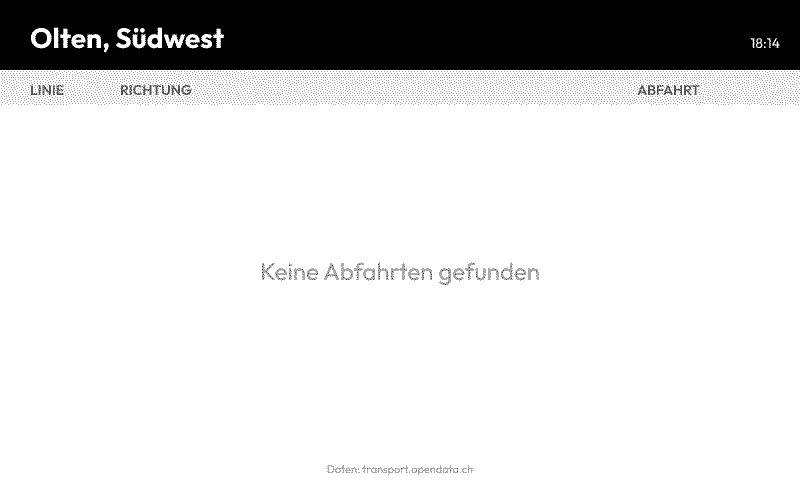

# Your First Screen

Let's create a simple screen that displays a greeting and the current time. This will introduce you to the basic workflow of creating Byonk screens.

## Step 0: Set Up Your Workspace

Byonk embeds all assets in the binary. To customize screens, you must set environment variables pointing to external directories.

**For binary users:**
```bash
# Set paths and start server (auto-seeds empty directories)
export SCREENS_DIR=./screens
export CONFIG_FILE=./config.yaml
byonk serve
```

**For Docker users:**
```bash
docker run -d --pull always -p 3000:3000 \
  -e SCREENS_DIR=/data/screens \
  -e CONFIG_FILE=/data/config.yaml \
  -v ./data:/data \
  ghcr.io/oetiker/byonk
```

On first run, empty directories are automatically populated with defaults. You can then edit the screen files under `screens/` and `config.yaml`.

> **Tip:** Keep the server running in a terminal. Lua scripts and SVG templates are reloaded on every request - just save and refresh!

## How screens are organized

A screen is a **folder** inside a screen package. Each screen folder holds three
fixed-name files:

| File | Purpose |
|------|---------|
| `meta.yaml` | Title, description, engine compatibility, and the parameter schema |
| `script.lua` | Data-fetch logic; returns a `data` table and optional `refresh_rate` |
| `screen.svg` | Tera SVG template rendered with that `data` |

A **package** is a directory tree with a `byonk-screens.yaml` manifest at its root; every
folder inside it that contains a `meta.yaml` is a screen. The bundled screens ship in the
embedded `byonk-builtin` package, whose folder layout looks like this:

```
screens/                       # the byonk-builtin package root
  byonk-screens.yaml           # package manifest (name, description, author, license)
  example/
    hello/                     # screen ref: byonk-builtin/example/hello
      meta.yaml
      script.lua
      screen.svg
```

A screen is referenced by `handle/path` — here `byonk-builtin/example/hello` — and that is the
value a device's `screen` field is set to. In this tutorial we build a screen at
`example/hello`.

## Step 1: Create the meta.yaml

Create `screens/example/hello/meta.yaml`. It describes the screen and (later) its parameters:

```yaml
title: Hello World
description: Displays a greeting with the current time.
byonk: "0.15"       # minimum byonk engine version this screen targets
refresh: 60         # default refresh in seconds (script.lua may override)
```

- `title` and `description` are shown by the admin API and the Home Assistant integration.
- `byonk` declares engine compatibility (bare version = caret range; see the design docs).
- `refresh` is an optional default; the Lua script's returned `refresh_rate` still overrides.

## Step 2: Create the Lua Script

Create `screens/example/hello/script.lua`:

```lua
-- Hello World screen
-- Displays a greeting with the current time

local now = time_now()

return {
  data = {
    greeting = "Hello, World!",
    time = time_format(now, "%H:%M:%S"),
    date = time_format(now, "%A, %B %d, %Y")
  },
  refresh_rate = 60  -- Refresh every minute
}
```

**What this does:**
- `time_now()` gets the current Unix timestamp
- `time_format()` formats it into readable strings
- The returned `data` table is passed to the template
- `refresh_rate` tells the device to check back in 60 seconds

## Step 3: Create the SVG Template

Create `screens/example/hello/screen.svg`:

```svg
<svg xmlns="http://www.w3.org/2000/svg" viewBox="0 0 800 480" width="800" height="480">
  <style>
    text {
      font-family: Outfit, sans-serif;
      fill: black;
      
    }
    .greeting { font-size: 48px; font-weight: 700; }
    .time { font-size: 72px; font-weight: 700; }
    .date { font-size: 24px; font-weight: 400; fill: #555; }
    .footer { font-size: 14px; font-weight: 400; fill: #999; }
  </style>

  <!-- White background -->
  <rect width="800" height="480" fill="white"/>

  <!-- Greeting -->
  <text class="greeting" x="400" y="120" text-anchor="middle">
    {{ data.greeting }}
  </text>

  <!-- Large time display -->
  <text class="time" x="400" y="260" text-anchor="middle">
    {{ data.time }}
  </text>

  <!-- Date below -->
  <text class="date" x="400" y="320" text-anchor="middle">
    {{ data.date }}
  </text>

  <!-- Footer -->
  <text class="footer" x="400" y="450" text-anchor="middle">
    My first Byonk screen!
  </text>
</svg>
```

**Template features used:**
- `{{ data.variable }}` - Inserts values from the Lua script's `data` table
- `` - Pulls in byonk's shared e-ink font hinting
  from the `byonk-base-v1` standard library (see [SVG Templates](svg-templates.md))
- CSS styling for fonts and colors
- `text-anchor="middle"` for centered text

## Step 4: Assign to a Device

Edit `config.yaml` and assign the screen to your device by its `handle/path` reference. There
is no separate `screens:` block — screens are auto-discovered from their package folders:

```yaml
devices:
  "YOUR:MAC:AD:DR:ES:S0":
    screen: byonk-builtin/example/hello
    params: {}
```

Replace `YOUR:MAC:AD:DR:ES:S0` with your device's actual MAC address.

> **Tip:** Check the Byonk server logs when your device connects - the MAC address is printed there.

## Step 5: Test It

1. **Restart Byonk** (config.yaml changes require restart)

2. **Check the API** at `http://localhost:3000/swagger-ui`:
   - Use the `/api/display` endpoint with your device's MAC
   - You'll get an image URL with a content hash
   - Open that URL to see your screen!

3. **Or wait for your device** to refresh automatically

## Adding Parameters

Let's make the greeting customizable. First declare the parameter in the screen's
`meta.yaml` so the admin API and Home Assistant know about it:

**screens/example/hello/meta.yaml:**
```yaml
title: Hello World
description: Displays a greeting with the current time.
byonk: "0.15"
refresh: 60
params:
  name:
    type: string
    label: "Name"
    default: "World"
    description: "Who to greet"
```

**screens/example/hello/script.lua:**
```lua
local now = time_now()

-- Get name from params, default to "World"
local name = params.name or "World"

return {
  data = {
    greeting = "Hello, " .. name .. "!",
    time = time_format(now, "%H:%M:%S"),
    date = time_format(now, "%A, %B %d, %Y")
  },
  refresh_rate = 60
}
```

**config.yaml:**
```yaml
devices:
  "YOUR:MAC:AD:DR:ES:S0":
    screen: byonk-builtin/example/hello
    params:
      name: "Alice"
```

Now your screen will say "Hello, Alice!" instead of "Hello, World!".

## Adding a QR Code

Let's add a QR code to the screen that links to documentation. QR codes are useful for providing quick access to related content.

**Update screens/example/hello/script.lua:**
```lua
local now = time_now()
local name = params.name or "World"

return {
  data = {
    greeting = "Hello, " .. name .. "!",
    time = time_format(now, "%H:%M:%S"),
    date = time_format(now, "%A, %B %d, %Y"),
    -- Generate a QR code anchored to bottom-right corner with 10px margin
    qr_code = qr_svg("https://www.youtube.com/watch?v=dQw4w9WgXcQ", {
      anchor = "bottom-right",
      right = 10,
      bottom = 10,
      module_size = 4
    })
  },
  refresh_rate = 60
}
```

**Update screens/example/hello/screen.svg** to include the QR code:
```svg
<!-- Add before the closing </svg> tag -->

<!-- QR Code - use 'safe' filter to render SVG -->
{{ data.qr_code | safe }}
```

The `qr_svg()` function generates pixel-aligned QR codes optimized for e-ink displays. Use `anchor` to specify which corner, and `top`/`left`/`right`/`bottom` for margins from that edge:

| Anchor | Margin options |
|--------|----------------|
| `top-left` | `top`, `left` |
| `top-right` | `top`, `right` |
| `bottom-left` | `bottom`, `left` |
| `bottom-right` | `bottom`, `right` |
| `center` | (centered on screen) |

**All options:**
```lua
qr_svg("https://example.com", {
  anchor = "bottom-right", -- Which corner (default: "top-left")
  right = 10,              -- Margin from right edge in pixels
  bottom = 10,             -- Margin from bottom edge in pixels
  module_size = 4,         -- QR "pixel" size (default: 4, recommended: 3-6)
  ec_level = "M",          -- Error correction: L/M/Q/H (default: M)
  quiet_zone = 4           -- QR quiet zone in modules (default: 4)
})
```

> **Tip:** Use the `| safe` filter in templates to render SVG content without escaping.

## Understanding the Result

Your screen should look like this:



## Troubleshooting

### Screen shows error

Check the Byonk logs for script errors:

```bash
byonk serve
# Look for ERROR or WARN lines
```

### Template variables not replaced

Make sure your Lua script returns a `data` table with the expected keys:

```lua
return {
  data = {
    greeting = "Hello"  -- Must match {{ greeting }} in template
  },
  refresh_rate = 60
}
```

### Device not updating

- Check that the device MAC in config matches exactly (uppercase, with colons)
- Verify the device is pointing to your Byonk server
- Check device WiFi connectivity

## Real-World Example: Transit Departures

Here's what a more complex screen looks like - the built-in Swiss departure board display:



This screen demonstrates:
- Fetching live data from an API
- Processing JSON responses
- Dynamic refresh rates (updates after each bus departs)
- Styled table layout with alternating rows
- Color-coded line badges

Check out the `screens/useful/swiss-departure-board/` folder
(`byonk-builtin/useful/swiss-departure-board`) in the Byonk source for the complete
implementation.

## What's Next?

Now that you have a basic screen working, learn more about:

- [Lua Scripting](lua-scripting.md) - Fetch data from APIs
- [SVG Templates](svg-templates.md) - Create complex layouts
