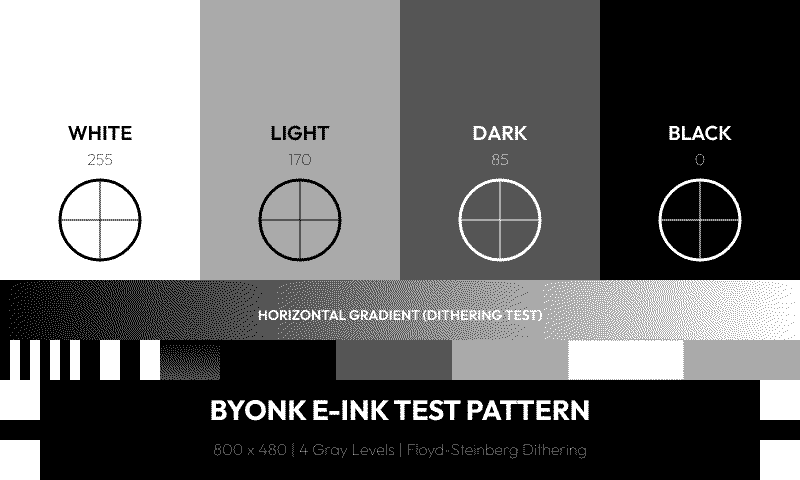

# SVG Templates

SVG templates define the visual layout of your screens. They use [Tera](https://tera.netlify.app/) templating syntax to insert data from your Lua scripts.

## Template Basics

A Byonk SVG template is a standard SVG file with Tera expressions:

```svg
<svg xmlns="http://www.w3.org/2000/svg" viewBox="0 0 800 480" width="800" height="480">
  <rect width="800" height="480" fill="white"/>

  <text x="400" y="240" text-anchor="middle" font-size="24">
    {{ message }}
  </text>
</svg>
```

**Key points:**
- Set `viewBox` to `0 0 800 480` for TRMNL OG (or `0 0 1872 1404` for TRMNL X)
- Always include `width` and `height` attributes
- Use `{{ variable }}` to insert values from Lua

## Display Dimensions

| Device | Width | Height | Aspect Ratio |
|--------|-------|--------|--------------|
| TRMNL OG | 800 | 480 | 5:3 |
| TRMNL X | 1872 | 1404 | 4:3 |

Byonk automatically scales your SVG to fit the display, but matching the aspect ratio gives the best results.

## Variables

### Template Namespaces

Variables in templates are organized into three namespaces:

| Namespace | Source | Example |
|-----------|--------|---------|
| `data.*` | Lua script return value | `data.title`, `data.items` |
| `device.*` | Device info (battery, signal) | `device.battery_voltage`, `device.rssi` |
| `params.*` | Config params from config.yaml | `params.station`, `params.limit` |

### Device Variables

These are automatically available under `device.*`:

| Variable | Type | Description |
|----------|------|-------------|
| `device.mac` | string | Device MAC address (e.g., "AC:15:18:D4:7B:E2") |
| `device.battery_voltage` | float or nil | Battery voltage (e.g., 4.12) |
| `device.rssi` | integer or nil | WiFi signal strength in dBm (e.g., -65) |
| `device.model` | string or nil | Device model ("og" or "x") |
| `device.firmware_version` | string or nil | Firmware version string |
| `device.width` | integer or nil | Display width in pixels (800 or 1872) |
| `device.height` | integer or nil | Display height in pixels (480 or 1404) |

```svg
<!-- Display battery and signal in header -->
<text class="status" x="780" y="25" text-anchor="end">
  {{ device.battery_voltage | round(precision=2) }}V
   · {{ device.rssi }}dBm
</text>

<!-- Responsive layout based on device dimensions -->

  <!-- TRMNL X layout (1872x1404) -->

  <!-- TRMNL OG layout (800x480) -->

```

> **Note:** Some device variables may be `nil` if the device doesn't report them. Always use `` to check before using.

### Basic Interpolation

```svg
<text>{{ data.title }}</text>
<text>{{ data.user.name }}</text>
<text>{{ data.items[0].label }}</text>
```

### Filters

Apply filters to modify values:

```svg
<!-- Truncate long text -->
<text>{{ data.description | truncate(length=50) }}</text>

<!-- Format timestamp (uses UTC) -->
<text>{{ data.updated_at | format_time(format="%H:%M") }}</text>

<!-- Get length -->
<text>{{ data.items | length }} items</text>
```

> **Tip:** The `format_time` template filter uses UTC timezone. For local time formatting, use `time_format()` in your Lua script and pass the pre-formatted string to the template.

### Default Values

```svg
<text>{{ data.title | default(value="Untitled") }}</text>
```

## Control Flow

### Conditionals

```svg

  <text fill="red">Error: {{ data.error }}</text>

  <text>All systems operational</text>

```

### Comparisons

```svg

  <text>{{ data.count }} items</text>

  <text>No items</text>



  <circle fill="green" r="10"/>

```

### Boolean Checks

```svg

  <text fill="green">Online</text>



  <text>No data available</text>

```

## Loops

### Basic Loop

```svg

  <text y="{{ 100 + loop.index0 * 30 }}">{{ item.name }}</text>

```

### Loop Variables

| Variable | Description |
|----------|-------------|
| `loop.index` | Current iteration (1-indexed) |
| `loop.index0` | Current iteration (0-indexed) |
| `loop.first` | True on first iteration |
| `loop.last` | True on last iteration |

### Positioning with Loops

```svg

  <!-- Calculate Y position based on index -->
  <text y="{{ 80 + loop.index0 * 40 }}">
    {{ dep.time }} - {{ dep.destination }}
  </text>

```

### Conditional Styling in Loops

```svg

  <!-- Alternating row backgrounds -->
  
    <rect y="{{ 100 + loop.index0 * 40 }}" width="800" height="40" fill="#f5f5f5"/>
  

  <text y="{{ 125 + loop.index0 * 40 }}">{{ item.name }}</text>

```

### Empty State

```svg

  
    <text>{{ item.name }}</text>
  

  <text fill="#999">No items found</text>

```

## Styling

### Inline Styles

```svg
<text x="20" y="40"
      font-family="sans-serif"
      font-size="24"
      font-weight="bold"
      fill="black">
  {{ data.title }}
</text>
```

### CSS in Style Block

```svg
<svg xmlns="http://www.w3.org/2000/svg" viewBox="0 0 800 480">
  <style>
    .title { font-family: sans-serif; font-size: 32px; font-weight: bold; }
    .subtitle { font-family: sans-serif; font-size: 18px; fill: #666; }
    .highlight { fill: #333; font-weight: bold; }
  </style>

  <text class="title" x="20" y="40">{{ data.title }}</text>
  <text class="subtitle" x="20" y="70">{{ data.subtitle }}</text>
</svg>
```

### Variable Fonts

Byonk supports variable fonts via CSS `font-variation-settings`:

```svg
<style>
  .light { font-family: Outfit; font-variation-settings: "wght" 300; }
  .regular { font-family: Outfit; font-variation-settings: "wght" 400; }
  .bold { font-family: Outfit; font-variation-settings: "wght" 700; }
</style>
```

> **Note:** Place custom font files (e.g., `Outfit-Variable.ttf`) in the `fonts/` directory.

## Colors and Grayscale

E-ink displays only show 4 gray levels. Design with this in mind:

### Recommended Colors

```svg
<style>
  .black { fill: rgb(0, 0, 0); }       /* Level 0 - Black */
  .dark { fill: rgb(85, 85, 85); }     /* Level 1 - Dark gray */
  .light { fill: rgb(170, 170, 170); } /* Level 2 - Light gray */
  .white { fill: rgb(255, 255, 255); } /* Level 3 - White */
</style>
```

### Testing Grayscale

The included `graytest.svg` demonstrates all 4 levels:

```svg
<rect x="0" y="0" width="200" height="480" fill="rgb(0,0,0)"/>
<rect x="200" y="0" width="200" height="480" fill="rgb(85,85,85)"/>
<rect x="400" y="0" width="200" height="480" fill="rgb(170,170,170)"/>
<rect x="600" y="0" width="200" height="480" fill="rgb(255,255,255)"/>
```

**Rendered output:**



### Avoid

- **Gradients** - Convert to dithered patterns (may look noisy)
- **Subtle color differences** - May become indistinguishable
- **Many gray levels** - Only 4 will render

## Layout Patterns

### Header + Content

```svg
<svg xmlns="http://www.w3.org/2000/svg" viewBox="0 0 800 480">
  <!-- Header bar -->
  <rect width="800" height="70" fill="black"/>
  <text x="30" y="48" fill="white" font-size="28">{{ data.title }}</text>
  <text x="770" y="48" fill="#aaa" font-size="14" text-anchor="end">{{ data.time }}</text>

  <!-- Content area -->
  <g transform="translate(0, 70)">
    <!-- Your content here, Y coordinates start at 0 -->
  </g>
</svg>
```

### Grid Layout

```svg

  {% set col = loop.index0 % 3 %}
  

  <rect x="{{ col * 266 }}" y="{{ 80 + row * 100 }}"
        width="260" height="90" fill="#f0f0f0" rx="5"/>
  <text x="{{ col * 266 + 130 }}" y="{{ 130 + row * 100 }}"
        text-anchor="middle">{{ item.name }}</text>

```

### Two Columns

```svg
<!-- Left column -->
<text x="30" y="100">Left content</text>

<!-- Divider -->
<line x1="400" y1="80" x2="400" y2="450" stroke="#ccc"/>

<!-- Right column -->
<text x="430" y="100">Right content</text>
```

## Dynamic Styling

### Conditional Colors

```svg

  <text fill="redblack">
    {{ item.name }}
  </text>

```

### Dynamic Classes

```svg
<text class="highlightnormal">
  {{ data.count }}
</text>
```

### Status Indicators

```svg

  <circle cx="20" cy="20" r="8" fill="green"/>

  <circle cx="20" cy="20" r="8" fill="orange"/>

  <circle cx="20" cy="20" r="8" fill="red"/>

```

## Common Patterns

### Truncating Long Text

```svg
<text>
  
    {{ data.title | truncate(length=30) }}
  
    {{ data.title }}
  
</text>
```

### Formatted Numbers

Use Lua to format numbers before passing to template:

```lua
-- In Lua script
return {
  data = {
    temperature = string.format("%.1f°C", temp),
    price = string.format("$%.2f", amount)
  }
}
```

### Time-Based Styling

```lua
-- In Lua script
local hour = tonumber(time_format(time_now(), "%H"))
return {
  data = {
    is_night = hour < 6 or hour > 20
  }
}
```

```svg
<rect width="800" height="480" fill="#333white"/>
```

## Debugging Templates

### Show Raw Data

```svg
<!-- Temporarily add this to see all data -->
<text x="10" y="460" font-size="10" fill="#999">
  Debug: {{ data.items | length }} items
</text>
```

### Check for Missing Data

```svg

  <text fill="red">ERROR: title is missing!</text>

```

### Template Errors

If your template has a syntax error, Byonk will display an error screen with the message. Check the server logs for details.

## Embedding Images

Byonk supports embedding images in your SVG templates. You can include PNG, JPEG, GIF, WebP, and SVG files.

### Asset Directory Structure

Place your screen assets in a subdirectory matching your screen name:

```
screens/
├── hello.lua         # Script at top level
├── hello.svg         # Template at top level
└── hello/            # Assets for "hello" screen
    ├── logo.png
    ├── icon.svg
    └── background.jpg
```

### Method 1: Direct in SVG (Automatic Resolution)

Simply reference images by filename in your SVG template. Byonk automatically resolves relative paths to the screen's asset directory and embeds them as data URIs:

```svg
<svg xmlns="http://www.w3.org/2000/svg" viewBox="0 0 800 480">
  <!-- This automatically loads screens/hello/logo.png -->
  <image x="10" y="10" width="64" height="64" href="logo.png"/>

  <text x="100" y="50">{{ data.greeting }}</text>
</svg>
```

**Supported image formats:**
- PNG (`.png`)
- JPEG (`.jpg`, `.jpeg`)
- GIF (`.gif`)
- WebP (`.webp`)
- SVG (`.svg`)

**Notes:**
- Paths are relative to the screen's asset directory
- URLs starting with `data:`, `http://`, or `https://` are left unchanged
- Missing images log a warning but don't break rendering

### Method 2: Via Lua (For Dynamic Images)

For more control, use `read_asset()` and `base64_encode()` in your Lua script:

**screens/hello.lua:**
```lua
local icon = read_asset("icon.png")

return {
    data = {
        greeting = "Hello World!",
        icon_src = "data:image/png;base64," .. base64_encode(icon)
    },
    refresh_rate = 3600
}
```

**screens/hello.svg:**
```svg
<svg xmlns="http://www.w3.org/2000/svg" viewBox="0 0 800 480">
  <image x="10" y="10" width="64" height="64" href="{{ data.icon_src }}"/>
  <text x="100" y="50">{{ data.greeting }}</text>
</svg>
```

This method is useful when you need to:
- Conditionally include images
- Fetch images from external URLs
- Process or transform image data

### Background Images

To use a full-screen background image:

```svg
<svg xmlns="http://www.w3.org/2000/svg" viewBox="0 0 800 480" width="800" height="480">
  <!-- Background image -->
  <image x="0" y="0" width="800" height="480" href="background.png" preserveAspectRatio="xMidYMid slice"/>

  <!-- Content on top -->
  <text x="400" y="240" text-anchor="middle" fill="white" font-size="32">
    {{ data.title }}
  </text>
</svg>
```

**Tips for background images:**
- Use `preserveAspectRatio="xMidYMid slice"` to cover the entire area
- Consider e-ink limitations: high-contrast images work best
- Keep file sizes reasonable for fast rendering

## Next Steps

- [Advanced Topics](advanced.md) - HTML scraping, error handling
- [API Reference](../api/lua-api.md) - Complete Lua function reference
